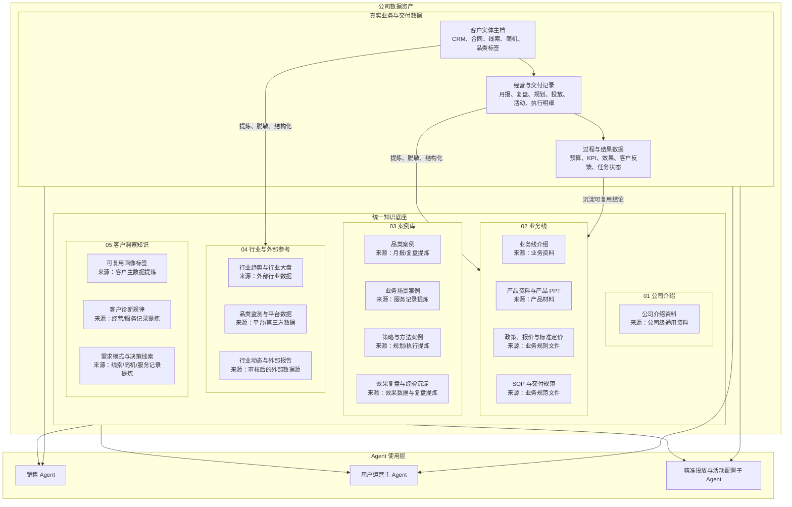
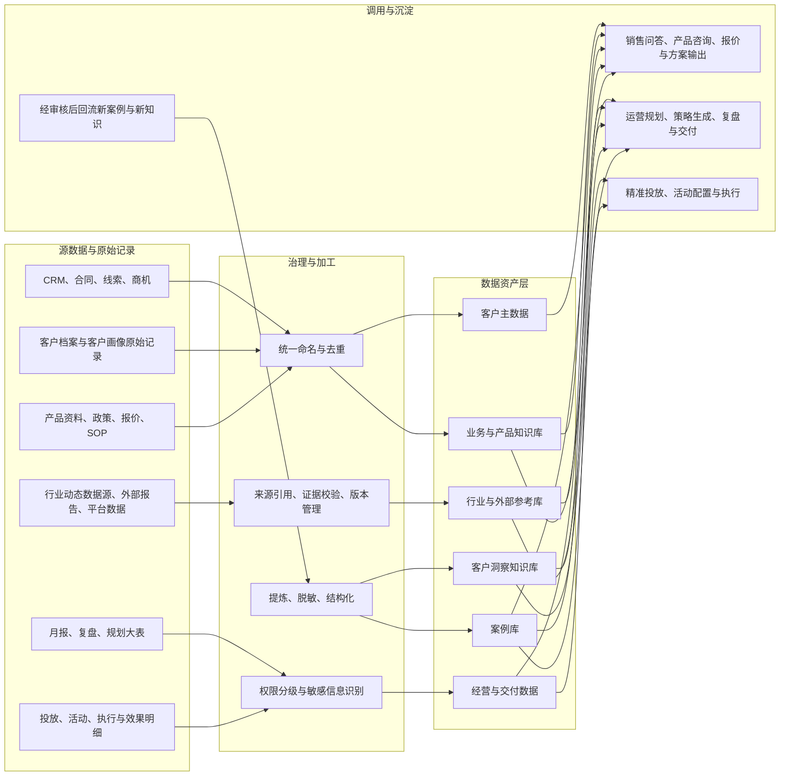
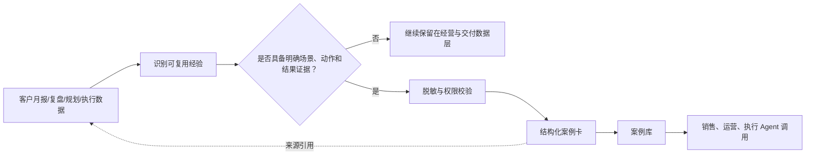

# 公司知识库整体架构图（初始版）

> 版本：V0.1
>
> 用途：用于先对齐“哪些数据属于真实业务数据、哪些进入统一知识底座、案例库在其中的位置”，再逐步补充目录、权限和技术实现。
>
> 依据：2026-09-04 Agent 进度同步会议中 JOJO 对知识库的口径，以及后续对现有数据类型与目录混乱问题的沟通。本文件是讨论初稿，不代表最终技术架构或最终目录。

## 1. 一句话结论

公司数据资产分为两大类：

1. **真实业务与交付数据**：服务某个客户、某个周期的原始事实和过程记录，用于日常执行、复盘与客户判断。
2. **统一知识底座**：将可复用的业务规则、方法、案例、行业参考和洞察组织起来，供销售 Agent、用户运营主 Agent 与执行子 Agent 共同调用。

**案例库属于统一知识底座的一部分，不与知识库并列。**

---

## 2. 汇报版：公司数据与 Agent 协作全景

### 汇报时应强调的三点

- **真实业务数据不等于知识库**：它保留客户、周期、预算和执行明细，是业务事实的唯一来源。
- **统一知识底座服务多个 Agent**：行业动态不仅服务销售，也可用于用户运营策略；案例既可支撑销售方案，也可支撑运营策略生成。
- **案例来自业务，但不复制业务原件**：月报、复盘等原件通过提炼与脱敏形成案例卡，案例卡再进入案例库。

### 目录来源说明

图中二级目录后的“来源”是该类知识的**主要形成来源**，不是指将原始文件直接复制进知识库：

| 一级目录 | 二级目录 | 主要来源 | 入库方式 |
|---|---|---|---|
| 公司介绍 | 公司级介绍、公司能力与通用资料 | 已确认的公司级通用资料 | 归档、版本管理、失效标记 |
| 业务线 | 每条业务线的介绍、产品资料与产品 PPT、政策报价、SOP | 已确认的业务、产品和规则文件 | 先按业务线归档，再按四类资料下钻 |
| 案例库 | 品类案例、业务场景案例、策略与方法、效果复盘 | 月报、复盘、规划、执行记录和效果数据 | 提炼、脱敏、结构化为案例卡，并保留来源引用 |
| 行业与外部参考 | 行业趋势、行业大盘、品类监测、平台数据、外部报告 | 已审核的外部数据源与采集结果 | 标注来源、获取时间、适用范围和可信度 |
| 客户洞察知识 | 可复用画像标签、诊断规律、需求模式 | 客户主数据、线索商机与服务记录 | 提炼、脱敏、结构化；原始客户信息仍留在客户主数据 |

---

## 3. 落地版：数据分层与归属

### 3.1 数据资产定义

| 数据资产 | 包含内容 | 主要用途 | 与案例库关系 |
|---|---|---|---|
| 客户实体主档 | CRM、合同、线索、商机、客户档案、客户画像原始记录、店铺与品类标签 | 客户识别、客户关系与权限判断；按客户实体归档，品类用于检索 | 不是案例；可为案例提供受控来源信息 |
| 经营与交付数据 | 月报、复盘、规划表、投放/活动/执行明细、预算、KPI、效果 | 当前客户服务、规划、复盘、执行 | 是案例的重要来源，但原件不复制到案例库 |
| 业务与产品知识库 | 业务介绍、产品资料、产品 PPT、政策、报价、标准定价、SOP | 产品咨询、报价、交付说明、方案输出 | 可作为案例的背景与可调用规则 |
| 案例库 | 品类/场景案例、策略、动作、投入、结果、适用条件、风险点 | 相似案例检索、策略生成、销售方案、培训 | 属于知识库；存放可复用的结构化经验 |
| 行业与外部参考库 | 行业趋势、行业大盘、品类监测、平台数据、行业动态 | 运营策略与销售洞察 | 可补充案例的外部背景，不替代案例证据 |
| 客户洞察知识库 | 脱敏后可复用的客户画像、诊断规律、需求模式 | 客户需求识别、策略前置判断 | 可作为案例检索条件或策略输入 |

---

## 4. 月报、复盘与案例库的边界

### 4.1 判定原则

| 问题 | 属于经营与交付数据 | 属于案例库 |
|---|---|---|
| 回答什么 | 某客户在某周期做了什么、结果如何、下月怎么办 | 类似客户/场景通常怎么做、什么条件下有效 |
| 记录形态 | 原始月报、复盘表、规划表、执行明细 | 结构化案例卡 |
| 粒度 | 客户级、周期级、明细级 | 品类/场景/策略级，可跨客户复用 |
| 敏感信息 | 可保留客户名、预算、明细与内部过程，但受权限控制 | 默认脱敏、摘要化；只保留必要证据与结论 |
| 典型调用 | 当前客户规划、复盘、服务交付 | 策略建议、销售方案、培训、相似案例检索 |

### 4.2 标准加工链路

### 4.3 案例卡最低字段

| 字段 | 说明 |
|---|---|
| 案例名称 | 使用“品类 + 场景 + 策略/目标”命名，避免只写客户名 |
| 适用条件 | 品类、客户阶段、业务类型、人群/痛点、前置约束 |
| 问题与目标 | 要解决的业务问题和预期目标 |
| 策略与动作 | 可复用的具体做法，而非原始表格全文 |
| 结果与证据 | 效果结论、指标口径、可展示的区间或摘要 |
| 风险与限制 | 不适用的条件、依赖项、失败原因 |
| 来源引用 | 指向原始月报、复盘或数据记录；保留权限控制，不在案例库复制原件 |
| 审核状态 | 待提炼、待业务审核、可复用、已下线 |

---

## 5. 现有命名与目录问题的处理原则

| 当前易混对象 | 初始统一名称 | 处理原则 |
|---|---|---|
| 客户档案数据 / 客户数据库 | 客户主数据 | 先统一定义，再去重；CRM、合同、线索、商机、客户档案不能因不同文件夹重复存放 |
| 精准营销 / 精准数据 / 京东数坊数据 | 精准营销业务数据 | 先按“业务对象 - 数据来源 - 数据用途”建立映射；避免按上传人或文件来源随意拆分 |
| 月报 / 复盘 / 经营报告 | 经营与交付数据 | 原件保留在业务数据层；符合条件的内容加工为案例卡 |
| 品类案例 / 销售案例 / 历史客户案例 | 案例库 | 用统一案例卡字段治理，再按品类、场景、业务线等多维检索 |
| 产品 PPT / 报价单 / 政策 / SOP | 业务与产品知识库 | 按业务线、产品、版本与生效状态管理 |
| 行业动态 / 行业大盘 / 平台数据 | 行业与外部参考库 | 同时记录数据源、获取方式、更新时间与适用范围 |

---

## 6. Agent 调用边界（初始口径）

| Agent | 优先读取 | 可沉淀回流 |
|---|---|---|
| 销售 Agent | 业务与产品知识、报价/SOP、案例、客户主数据、客户洞察、行业参考 | 经审核的销售案例、客户需求模式、产品问答缺口 |
| 用户运营主 Agent | 经营与交付数据、案例、行业参考、客户洞察、产品/SOP | 经审核的运营案例、策略方法、复盘结论 |
| 精准投放子 Agent | 精准营销业务数据、案例、行业参考、策略规则 | 经审核的投放策略案例与效果总结 |
| 活动配置子 Agent | 活动业务数据、案例、策略规则、权益/SOP | 经审核的活动配置案例与执行经验 |

> 原则：Agent 可以读取其获授权的数据；**不能把调用过的原始数据直接写入知识库或案例库**。回流必须经过提炼、脱敏、结构化与业务审核。

---

## 7. 需在下一轮确认的事项

1. 客户画像在“客户主数据”和“客户洞察知识库”之间的具体提炼与权限规则。
2. 案例库的一级检索维度：优先按品类、业务线、场景还是客户生命周期组织。
3. 产品资料、报价、SOP 的版本、生效时间、废止与责任人机制。
4. 行业动态的首批数据源清单、更新频率与来源可信度标记。
5. 各类数据的读取权限、脱敏规则和案例审核人。
6. RAGflow、CRM、合同、观象台、京东云录等系统的实际接入方式和字段映射。

## 8. 当前阶段的交付边界

本初稿只定义业务架构与数据归属。以下内容暂不在本版定稿：

- 具体文件夹结构、数据库表结构、向量库切分方式。
- RAGflow 或其他技术平台的实施方案。
- 每个字段的权限规则、接口与数据同步频率。
- 全量资料迁移和历史数据清洗。
